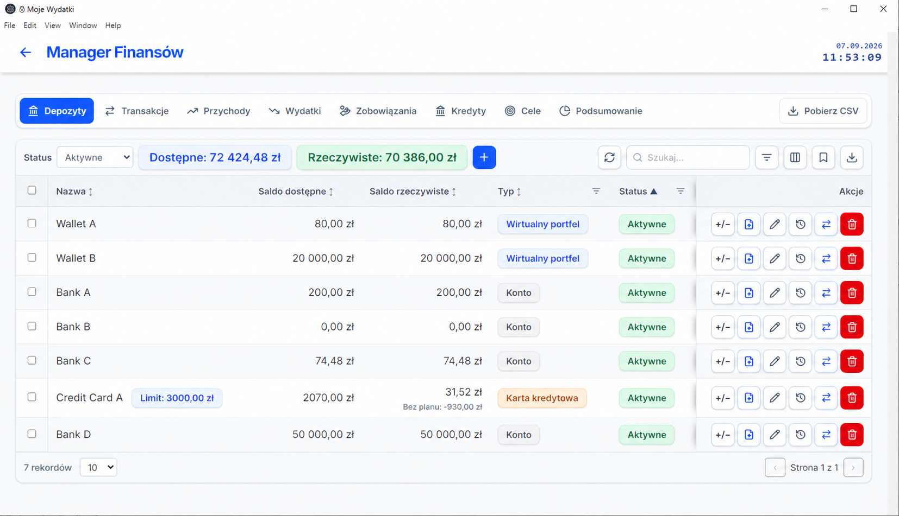
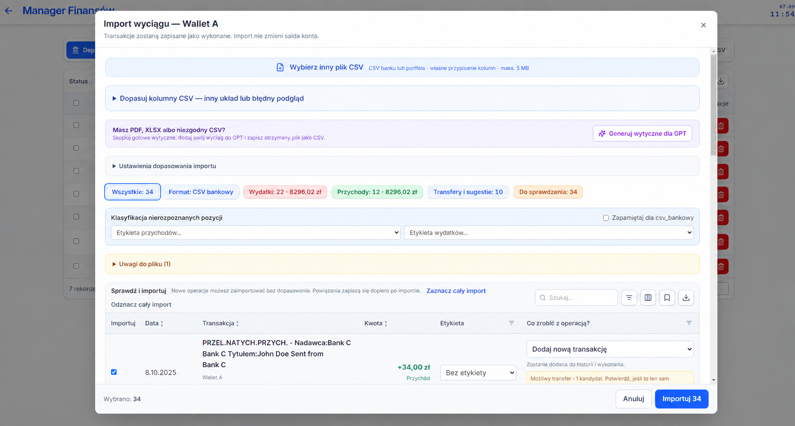
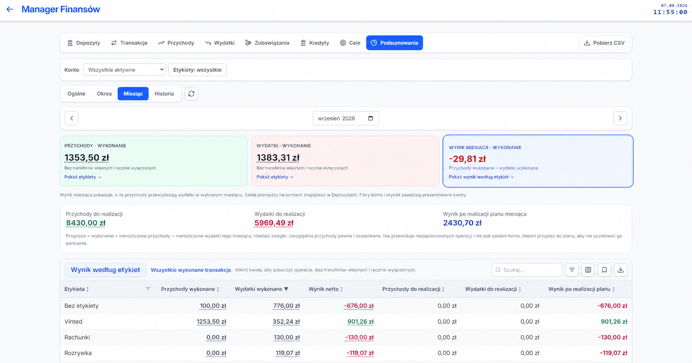
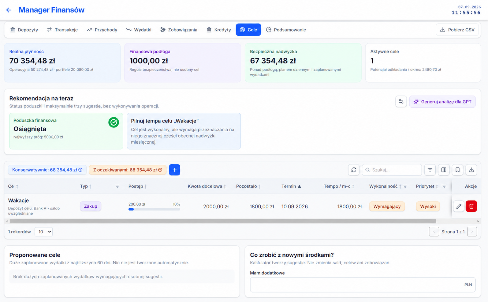
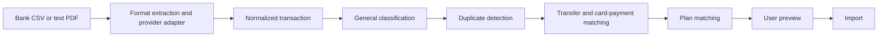

# MyAnalyze

Offline-first desktop application for planning, tracking, and reconciling personal finances.

MyAnalyze combines deliberate manual planning with bank statement imports. It keeps planned and completed operations separate, preserves account history, and makes reconciliation decisions visible to the user instead of silently changing financial data.

> **Portfolio project:** the repository contains only source code and a clean SQLite template. Real financial records, imported statements, local databases, and generated backups are intentionally excluded.

## Highlights

- Plan-versus-actual tracking for income and expenses
- CSV and text-based PDF statement import with review before saving
- Shared normalization and classification pipeline across bank formats
- Duplicate detection, including occurrence-aware fingerprints for repeated rows
- User-confirmed internal transfer and credit-card payment linking
- Credit cards, liabilities, loans, installments, and recurring operations
- Monthly and pay-cycle summaries with historical snapshots
- Configurable transaction labels, filters, reports, and CSV exports
- Polish and English interface with a global PLN/EUR/USD presentation setting (no currency conversion)
- User-defined percentage allocation of new funds between financial goals
- Local SQLite storage with no cloud account or bank connection
- Windows desktop packaging with Electron

## Why this project is interesting

Personal-finance data is simple to display but surprisingly easy to interpret incorrectly. MyAnalyze focuses on a few explicit rules:

- A plan and its execution are different records.
- Importing a bank operation does not mutate an account balance.
- An imported operation counts in the budget unless there is a concrete reason to exclude it.
- A transfer between owned accounts remains visible on both accounts but must not inflate income or expenses.
- Similarity alone is not enough to classify an operation as a duplicate or internal transfer.

This keeps the product understandable without turning it into an accounting system.

## Screenshots

The interface is shown with synthetic demo data. No real account identifiers or bank statements are included.

| Finance manager | Statement import review |
| --- | --- |
|  |  |

| Monthly summary | Financial goals |
| --- | --- |
|  |  |

## Statement reconciliation



The adapter owns bank-specific field and transaction-type mappings. Everything after normalization uses the same financial rules, so budgeting and reporting do not depend on phrases emitted by one bank.

## Architecture

```text
React + TypeScript + Vite
          |
          | HTTP on localhost
          v
Node.js + Express + TypeScript
          |
          v
       SQLite

Electron starts the local backend and packages the application for Windows.
```

The frontend contains reusable grids, forms, and pure calculation models. The backend validates requests and coordinates transactional updates between related entities. SQLite remains the single local source of persisted application data.

## Tech stack

- React 19, TypeScript, Vite, Tailwind CSS
- Node.js, Express
- SQLite
- Electron and electron-builder
- Jest and Testing Library

## Running locally

### Requirements

- Windows 10 or newer
- Node.js 20 or newer with npm
- PowerShell

### Setup

```powershell
git clone <repository-url>
cd MyAnalyze
Set-ExecutionPolicy -Scope Process Bypass
.\InstallDependencies.ps1
.\RunFrontendBackend.ps1
```

Open `http://127.0.0.1:5173`. The backend runs locally on `http://127.0.0.1:3003`.

The PowerShell scripts use the Node.js runtime in `tools/` when present and otherwise fall back to the system installation. The bundled runtime itself is not stored in Git.

## Tests

```powershell
.\RunAutotests.ps1
```

The test suite covers frontend models and UI behavior as well as backend API smoke scenarios. API tests are designed to use a temporary copy of the clean database template.

## Building the Windows installer

```powershell
.\BuildElectron.ps1
```

The installer is generated in `dist/`. Build artifacts are intentionally excluded from the repository and should be attached to a versioned GitHub Release instead.

## Data and privacy

- Application data is stored locally in SQLite.
- Imported statements are processed on the user's computer. PDF contents are used only for the preview and are not written to the activity log.
- The application has no direct bank integration, cloud synchronization, or user accounts.
- `dbmigration/myanalyz.template.sqlite` contains the schema and neutral defaults only.
- Local databases, statements, exports, documents, logs, backups, and environment files are ignored by Git.

Never attach real financial data to a public issue or pull request.

## Documentation

Detailed product and engineering documentation is maintained in Polish:

- [Product scope](documentation/01-CEL-I-ZAKRES.md)
- [Business rules](documentation/02-REGULY-BIZNESOWE.md)
- [CSV and PDF import](documentation/03-IMPORT-CSV.md)
- [Architecture and development](documentation/04-ARCHITEKTURA-I-ROZWOJ.md)
- [Product decisions and QA](documentation/05-DECYZJE-PRODUKTOWE-I-QA.md)
- [Import data model](documentation/08-MODEL-DANYCH-IMPORTU.md)
- [Run and build commands](Instrukcja/KOMENDY-URUCHAMIANIE-I-BUILD.md)

## Project status

Version 1.5.0 is a functional Windows desktop application. It adds a Polish/English interface, a global presentation currency, custom goal allocation, and text-based PDF statement import. The current focus is stability, transparent financial rules, and a straightforward offline workflow.

## License

No open-source license has been selected yet. Until a license is added, the source code is available for viewing but standard copyright restrictions apply.
